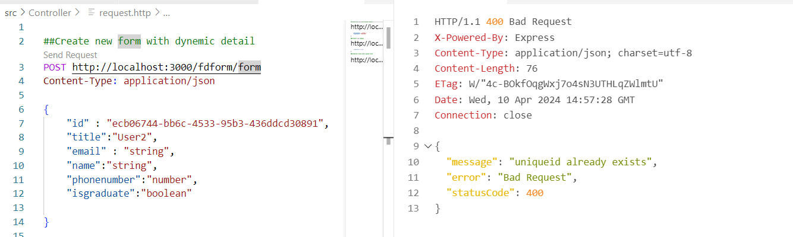
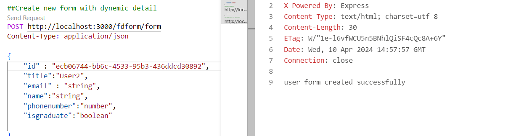
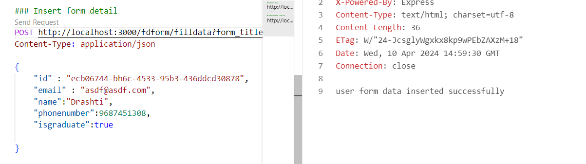
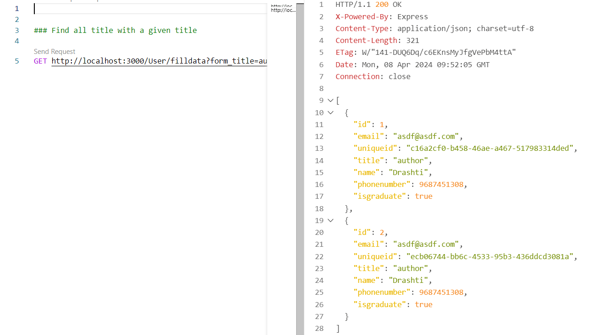

# NestJs configuration
This is a sample NestJS API project that provides endpoints for managing form data.

## Getting Started
To get started with the project, follow these steps:

## Need to Install Prerequisite Software in local machine:

Make sure you have the following software installed on your machine:
- Node.js and npm

## To setup Project just follw step.

- Take a git clone of project from remote repositiory by using below command (Sample repo)
   [(https://github.com/drashtijogani1992/NestAssessment.git)]()

## How to run the project

1. Run the project using below command
npm run start:dev

2. Open request.http

### POST fdform/form
It will create a new form with a unique id and title name.
If unique data is already present, then it is shown as already existing data.
It will create another form field table with the field name and field type.

### POST fdform/filldata?form_title=User2
It will validate all input property types and insert form data.

### GET fdform/filldata?form_title=author

It will provide all data whose name is with the author.

